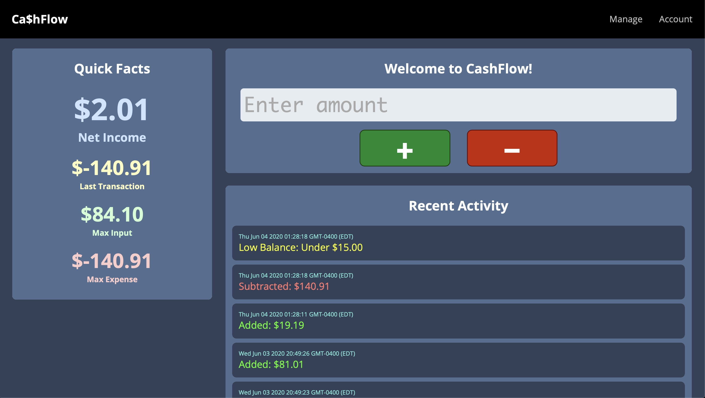
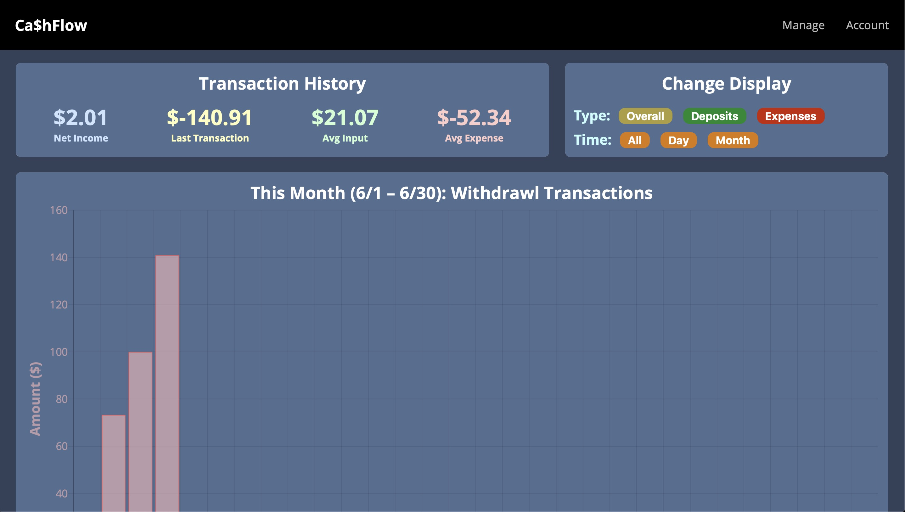

# CashFlow

This is an ATM web app for budgeting finances w/ a customizable transaction history data visualization tool.
Website Link: https://cashflow-atm.herokuapp.com

The application has two pages, one to manage an account and one to view an account's history. The manage account page allows a user to log their transactions, see quick facts about their account's statisics, as well as customizable alerts showing the 5 most recent actions (including low-balance warnings. The view page allows a user to see a visualization of their transaction history and other statistics on their spending/earnings using Chart.js. They have 9 different customizations options for the time scale and type of transaction to view. All data is managed through a database for long-term storage of one's banking profile. Website is hosted using AWS, Heroku, Git.

Pages were built using HTML5/CSS. Main framework was built through Javascript on both client- and server-side. Initial steps were desiging page layouts and UI/UX design. Next steps were on the back-end, integrating a MongoDB database with Node.js/Express to build and design a REST API for managing 6 different request pipelines to manage account statistics, alerts, and transaction history. Following this, I built the front-end with basic Javascript frameworks to handle events, user input, and updating using fetch and async. This also involved data processing for future graphing. Data visualization was designed using Chart.js external library. Site was tested on several users for UI/UX feedback.

Pages Design:

  HomePage
  
  
  Data Visualization Tool
  
Features:
- 2 pages to manage budgeting account
  - Manage: handle user interaction
  - Account: data visualization of transaction statistics
- ATM logger for easy deposit/withdrawls
- Customizable alerts for helpful feedback on spending
- Data visualization tool of transacion history

Tools Used:
- Chart.js - handle data charting and visualizing
- Node.js/Express/MongoDB - storing/managing persistent user transaction data
- REST - design and implement an API
- AWS, Heroku, Git - Hosting website

Set-Up:
- Download latest versions of Node.js, NPM, MongoDB (recommended to use Homebrew)
- Run `npm install` inside project folder in command line to initialize node modules
- Create a directory for your MongoDB database and run `mongod --dbpath=PATH_TO_YOUR_DB_DIRECTORY` in command line 
- Access page through localhost:1930

